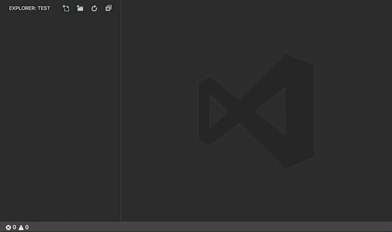

# VSC Terminals

<p align="center">
	
</p>

An extension for setting-up multiple terminals at once, or just running some commands.

The extension is configured using a very easy to edit JSON file.

Check the demo below to learn more.

## Install

Run the following in the command palette:

```shell
ext install vscode-terminals
```

## Usage

It adds 3 new commands to the command palette:

```js
Terminals: Edit configuration // Open the configuration file, it will create it for you if needed
Terminals: Kill // Kill all the terminals
Terminals: Run // Run all the terminals
Terminals: Run single // Select a single terminal to run (cmd+alt+p on Mac, ctrl+alt+p Elsewhere)
```

## Configuration

Run the `Terminals: Edit configuration` command to create the configuration file. By default it uses a file named `terminals.json` under the `.vscode` directory, you can change this by supplying a custom path using the `terminals.configPath` setting entry.

The configuration is an object that looks like this:

```js
{
  "autorun": true, // Execute `Terminals: Run` automatically at startup
  "terminals": [ // Array of terminals to open
    { // An object describing a terminal, most entries are optional
      "name": "My Terminal", // The name of the terminal, it will be displayed in the dropdown
      "icon": "code", // An icon to show next to the name
      "command": "whoami", // Single command to run
      "commands": [ // Multiple commands to run
        "cd to/my/chest",
        "touch my_heart"
      ],
      "open": true, // Open the terminal after running its commands
      "focus": true, // Open the terminal and focus to it
      "onlySingle": true, // Don't run this with the `Terminals: Run` command
      "onlyMultiple": true, // Make it unrunnable with the `Terminals: Run single` command
      "execute": false, // Write the last command without executing it
      "shellPath": '/bin/bash', // Path to a custom shell executable
      "shellArgs": ["--foo"] // Arguments to pass to the shell executable
    },
    {...} // Another terminal, same as above
  ]
}
```

## Demo

#### Edit configuration + Run:



#### Run single


## Hints

- **Self-destroying terminals**: it's a common use case to run some commands and then close the terminal, to do this simply put a `logout` command at the end of your commands list.

## License

MIT © Fabio Spampinato
